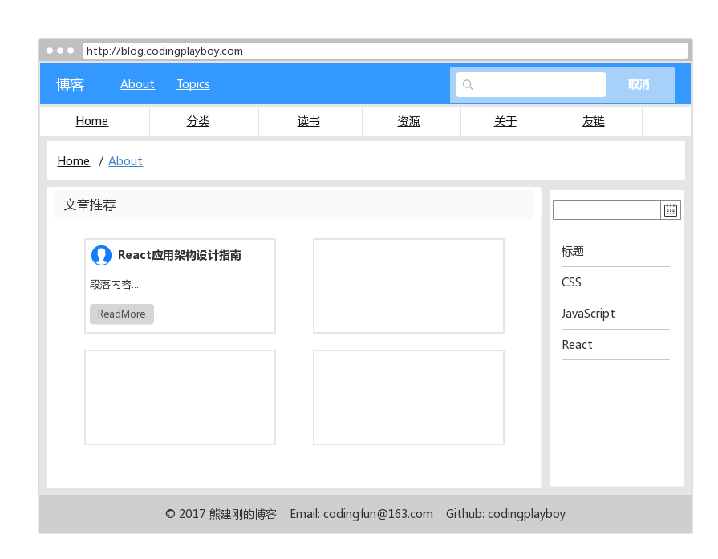
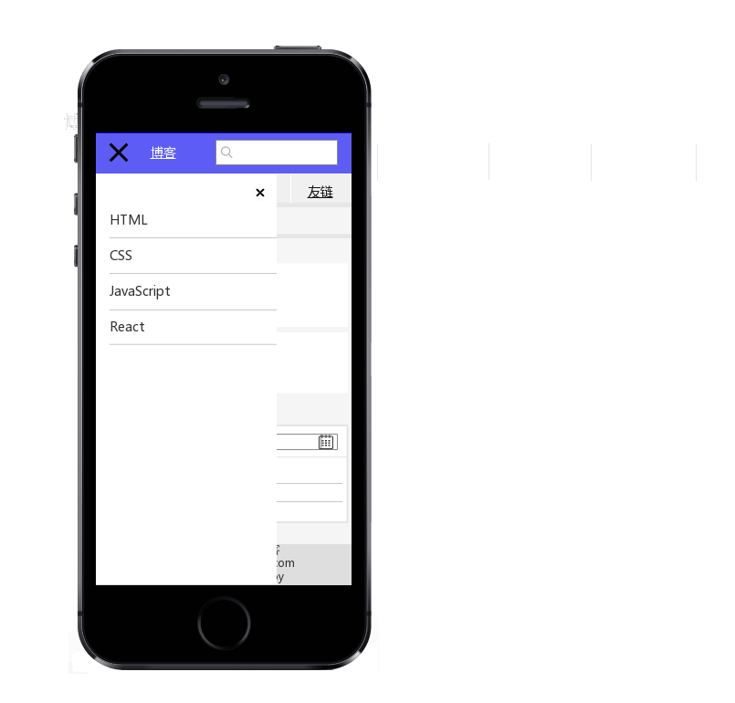

# Develop a blog with React/Webpack/material-ui

Develop a blog with React, Webpack, Babel, Eslint, documentation.js and material-ui.

And I will record all resources and process through the entire development of the project.

## Run

1. `git clone https://github.com/codingplayboy/react-blog.git`
2. `cd react-blog`
3. `npm install yarn -g`
4. `yarn install`
5. `yarn start` for develop
6. `yarn build` for production
7. `yarn doc` for create API doc

## API

1. [API](https://github.com/codingplayboy/react-blog/blob/master/API.md)

## Development Process

1. [Webpack自动化构建实践指南](https://github.com/codingplayboy/react-blog/blob/master/docs/initWebpack.md)
2. [刷新页面react-router路由访问失败问题解决方案](https://github.com/codingplayboy/react-blog/blob/master/docs/webpack-dev-server-reflush-404.md)
3. [React应用架构设计](https://github.com/codingplayboy/react-blog/blob/master/docs/react-app-structure.md)

## Structure introduction

1. `webpack`: 为webpack配置目录；
2. `webpack.config.js`: 为webpack配置入口文件；
3. `package.json`: 为项目依赖管理文件；
4. `yarn.lock`: 为项目依赖版本锁文件；
5. `.babelrc`: babel的配置文件，使用babel编译React和JavaScript代码；
6. `eslintrc, eslintignore`: 分别为eslint语法检测配置及需要忽略检查的内容或文件；
7. `postcss.config.js`: CSS后编译器postcss的配置文件；
8. `API.md`: API文档入口；
9. `docs`: 文档目录；
10. `README.md`: 项目说明文档； 
11. `src`: 开发代码目录
   1. ├──`api` 请求API
   2. ├──`styles` 样式
   3. ├──`components` 展示型组件
   4. ├──`config` 全局配置
   5. ├──`constants` 常量
   6. ├──`containers` 容器组件
   7. ├──`helper` 辅助／工具函数
   8. ├──`store` redux store相关
   9. ├──`middlewares` 中间件
   10. ├──`routes` 应用路由模块
   11. ├──`services` 应用服务模块
   12. ├──`index.html` 应用入口html
   13. ├──`app.js` 项目根组件文件

## Product Prototype

自己画的UI原型图，比较简陋，权且看看，欢迎吐槽，嘿嘿👀。

### PC UI

### Mobile UI

### Mobile Side Nav UI

## Development Log

1. 项目基础布局（使用[material-ui](https://material-ui-next.com/）)
  1. 搭建首页基本结构
  2. 响应式展示
2. 首页文章列表：
  1. 初始加载及翻页
  2. 列表自适应排布展示
3. 侧滑导航栏切换
4. 底部版权及联系方式声明组件  
